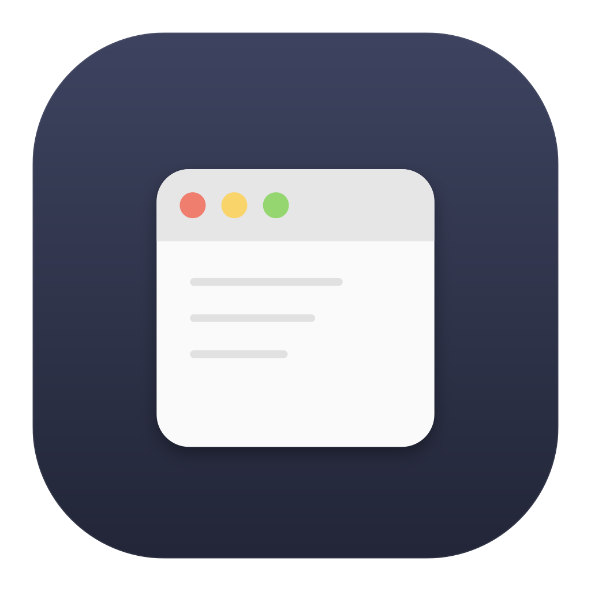

<div align="center">



# WinHub

**Windows comforts for macOS.**

A lightweight menu-bar app that brings back the little habits you miss after
switching from Windows — one toggle at a time.

[](LICENSE)
[](#requirements)
[](https://github.com/v2matosevic/WinHub/releases)

</div>

---

## Why

macOS is great, but if your muscle memory comes from Windows, a few things feel
wrong: closing the last window doesn't quit the app, and hovering the Dock
doesn't show you window previews. WinHub adds those behaviors back as small,
independent **modules** you turn on or off from the menu bar. No Dock icon, no
clutter — it just sits in your status bar.

## Features

- **Close button quits the app** — closing an app's last window quits it,
  Windows-style. It's a graceful quit, so apps with unsaved work still prompt
  you. A built-in safe list (Finder, System Settings, Dock, Control Center)
  is never quit, and you can exclude any other app.
- **Dock hover previews** — hover a Dock icon to see live thumbnails of that
  app's windows, like the Windows taskbar. Click a thumbnail to jump straight
  to that window. Minimized windows are shown too, and clicking restores them.
- **Starts at login** and stays out of your way in the menu bar.

More tweaks are on the [roadmap](#roadmap) — and the module system makes adding
one straightforward (see [CONTRIBUTING](CONTRIBUTING.md)).

## Install

### Homebrew (recommended)

```bash
brew install --cask v2matosevic/tap/winhub
```

Homebrew clears the download quarantine for you, so it launches without any
Gatekeeper prompt.

### Direct download

1. Grab `WinHub.dmg` from the [latest release](https://github.com/v2matosevic/WinHub/releases).
2. Open it and drag **WinHub** into **Applications**.
3. First launch only: **right-click the app → Open** (WinHub isn't notarized by
   Apple, so a plain double-click shows a warning the first time). After that it
   opens normally.

   > Prefer the terminal? `xattr -dr com.apple.quarantine /Applications/WinHub.app`

## Permissions

WinHub asks only for what each module needs, and only when you enable it:

| Permission | Used by | Why |
| --- | --- | --- |
| **Accessibility** | Close-to-quit, window raising | Observe window close events and raise windows. |
| **Screen Recording** | Dock hover previews | Capture the thumbnail images of your windows. |

Accessibility takes effect immediately. **Screen Recording only applies on a
fresh launch** — after granting it, use **Relaunch WinHub** from the menu. If
WinHub isn't listed under *Privacy & Security → Screen & System Audio
Recording*, add it with the `+` button.

## Requirements

- macOS 14 (Sonoma) or later.

## Building from source

You only need Apple's Command Line Tools (Swift 6+) — no full Xcode required.

```bash
git clone https://github.com/v2matosevic/WinHub.git
cd WinHub
./build.sh            # builds and code-signs WinHub.app
open WinHub.app
```

If you're iterating, set up a stable local signing identity once so your
permission grants survive rebuilds:

```bash
./Scripts/dev_identity.sh
```

See [docs/ARCHITECTURE.md](docs/ARCHITECTURE.md) for how the app is structured
and how to add a module.

## Roadmap

- Window snapping (drag-to-edge tiling)
- Alt+Tab per-window switching
- Cut & paste files in Finder (⌘X)
- A real preferences window (exclusions, hover delay)

Got an idea? [Open an issue](https://github.com/v2matosevic/WinHub/issues).

## Contributing

Contributions are welcome — see [CONTRIBUTING.md](CONTRIBUTING.md).

## License

[MIT](LICENSE) © 2026 Version2

<div align="center"><sub>Made by <b>Version2</b>.</sub></div>
